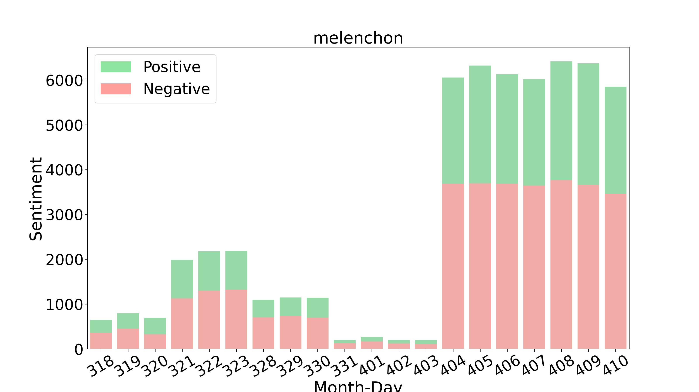
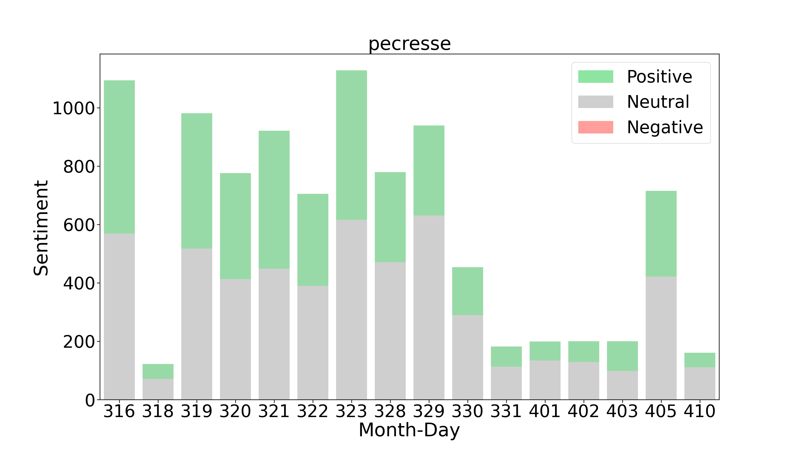
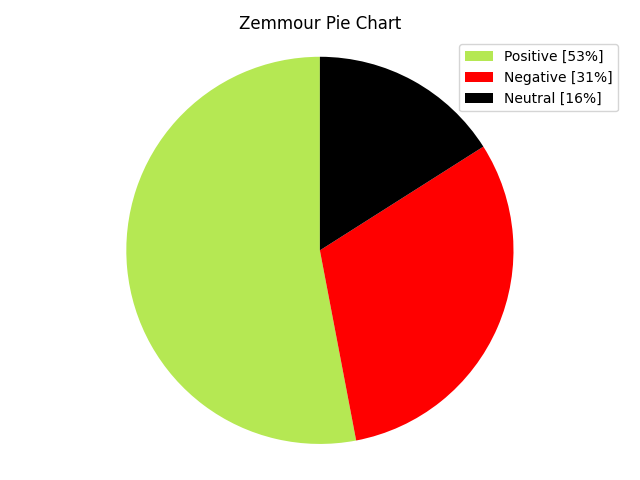
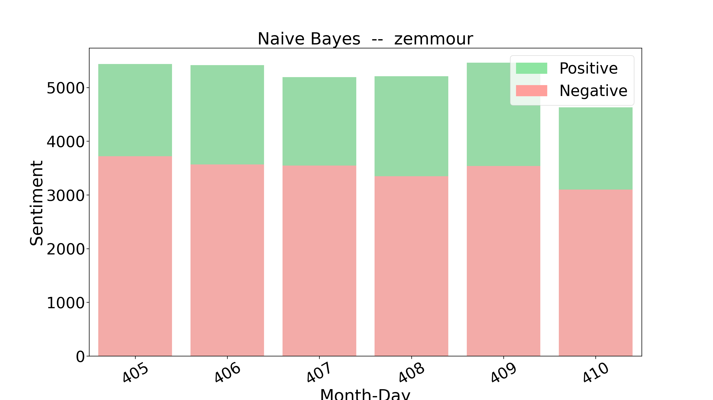
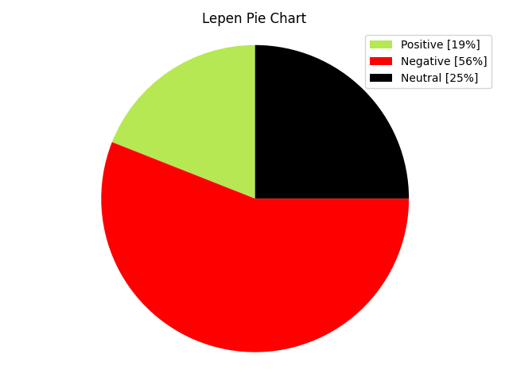
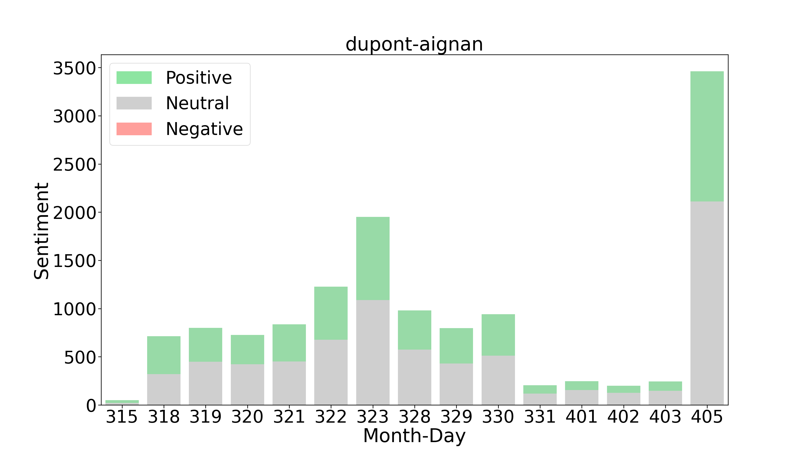

# Sentimental Big Brother

<div style="text-align:center"></div>

----

# Table of contents

- [Sentimental Big Brother](#sentimental-big-brother)
- [Table of contents](#table-of-contents)
- [Description](#description)
  * [French](#french)
  * [English](#english)
- [Preliminary results](#preliminary-results)
  * [Melenchon](#melenchon)
    + [Stacked bar](#stacked-bar)
    + [Pie](#pie)
  * [Pecresse](#pecresse)
    + [Stacked bar](#stacked-bar-1)
    + [Pie](#pie-1)
  * [Macron](#macron)
    + [Pie](#pie-2)
  * [Zemmour](#zemmour)
    + [Pie](#pie-3)
    + [Stacked bar](#stacked-bar-2)
  * [Le Pen](#le-pen)
    + [Pie](#pie-4)
  * [Jadot](#jadot)
    + [Pie](#pie-5)
- [How to run as a module](#how-to-run-as-a-module)
  * [How to download the datasets:](#how-to-download-the-datasets-)
    + [AclIMDB](#aclimdb)
    + [Twitter](#twitter)
  * [How to process raw data with a given model:](#how-to-process-raw-data-with-a-given-model-)
- [Contributors](#contributors)

<small><i><a href='http://ecotrust-canada.github.io/markdown-toc/'>Table of contents generated with markdown-toc</a></i></small>


# Description

## French

En 2021, selon le rapport de l'Economist Intelligence Unit, la France a été classée comme démocratie défaillante par le [Democracy Index](https://en.wikipedia.org/wiki/Democracy_Index#:~:text=The%20Democracy%20Index%20is%20an,the%20weekly%20newspaper%20The%20Economist.).

Nos démocraties se numérisent depuis plusieurs années, et une part croissante du débat public se joue dorénavant sur les réseaux sociaux. 
Alors qu’en période d'élections les [débats télévisées sont encadrées par l’ARCOM](https://www.arcom.fr/presse/larcom-le-regulateur-de-la-communication-audiovisuelle-et-numerique-dossier-de-presse) (ex-CSA), les débats au sein des réseaux sociaux échappent encore à un contrôle clair, et notamment par manque de métriques caractérisant les enjeux qui les traversent.

En tant que citoyens, et en tant qu'étudiants dans l’intelligence artificielle nous ressentons le besoin de mettre au service de notre démocratie des outils permettant de décrypter une partie du débat politique qui se déroule aujourd’hui sur Twitter.

A cet effet, nous étudions aujourd’hui le sentiment de la twittosphère à l’encontre des différents candidats en fonction du temps.

Merci de l’attention que vous portez à notre travail, tout commentaire et toute aide est la bienvenue.

==============================


## English

In 2021, according to the [Democracy Index](https://en.wikipedia.org/wiki/Democracy_Index#:~:text=The%20Democracy%20Index%20is%20an,the%20weekly%20newspaper%20The%20Economist.)  published by the [Economist Intelligence Unit](https://en.wikipedia.org/wiki/Economist_Intelligence_Unit), France has been ranked as a flawed democracy.

Our democraties have been going digital for several years, and an increasing part of the public debate is now played on social networks.  Although during election periods televised debates are [supervised by ARCOM](https://en.wikipedia.org/wiki/Regulatory_Authority_for_Audiovisual_and_Digital_Communication) (ex-CSA), debates within social networks still escape clear control, notably due to the lack of metrics characterizing the issues that run through them.

As citizens, and as students in artificial intelligence, we feel the need to put at the service of our democracy some tools allowing to decipher part of the political debate that now takes place on Twitter.

To this end, today we are studying the sentiment of the twittosphere against the different candidates as a function of time.

Thank you for your attention to our work, any comments and help are welcome.


# Preliminary results

## Melenchon

### Stacked bar



### Pie


## Pecresse 

### Stacked bar



### Pie


## Macron

### Pie


## Zemmour

### Pie



### Stacked bar



## Le Pen

### Pie



## Jadot

### Pie


## Dupont-Aignan

### Stacked bar



# How to run as a module

```sh
poetry run python -m src --argument
```

## How to download the datasets:

### AclIMDB

```python
poetry run python -m src data --download aclImdb
```


### Twitter
One can download tweets from twitter, a candidat must be mention:

```python
poetry run python -m src data --download twitter --mention [candidat]
```
[candidat] must be within ["Pecresse", "Zemmour", "Dupont-Aignan", "Melenchon", "Le Pen", "Lassalle", "Hidalgo", "Macron", "Jadot", "Roussel", "Arthaud", "Poutou"]

You have several more parameters accessible:
* `--text`: text you wish to find in the tweet: `--text retraite`
* `--start_time`: date from which you want to start to collect the tweets (need to follow the format: `YYYY-mm-DD HH:MM`, `HH` and `MM` are optional)
* `--end_time`: date until which you want to collect the tweets (need to follow the format: `YYYY-mm-DD HH:MM`, `HH` and `MM` are optional)

The dataset collected from twitter are saved into file: `data/raw/[candidat]/twitter_{mention}_{start_time}_{end_time}.csv`.

## How to process raw data with a given model:

The following command applies a model to a given `.csv` file or recursively to all `.csv` files in a directory.
The path is relative to the `data/raw` directory.

```python
poetry run python -m src features --model [model_name] --data [path_relative_to_data_raw]
```

The model name must be within ["random", "naive_bayes", "twitter-xlm-roberta-base-sentiment"] and the default is "twitter-xlm-roberta-base-sentiment".

The output of the model is added in new columns and saved to a `.csv` file with the same path and name but relative to the `data/processed` directory.


# Contributors

* [Matthieu David](https://github.com/madvid) - mdavid@student.42.fr
* [Alexandre Gilmet](https://github.com/goldimet) - agilmet@student.42.fr
* [Guillaume Sallé](https://github.com/guillaume-salle) - gusalle@student.42.fr
* [Archibald Thirion](https://github.com/archips) - athirion@student.42.fr
* [Clément Vidon](https://github.com/clemedon) - cvidon@student.42.fr
* [Louis Develle](https://github.com/ezalos) - ldevelle@student.42.fr
